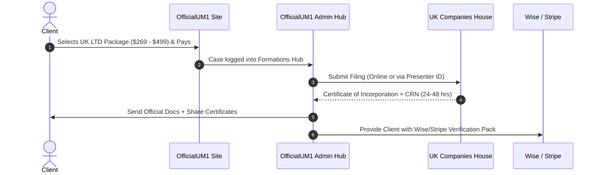

# OfficialUM1 — UK Company Formation & Companies House Playbook

> **Document Type:** Operational & Integration Guide  
> **Target Jurisdiction:** United Kingdom (Companies House & HMRC)  
> **Last Updated:** September 2026  
> **Status:** Active Reference  

---

## 1. Executive Summary & Fee Architecture

Under the **Economic Crime and Corporate Transparency (ECCT) Act**, UK Companies House revised its official statutory fees.

### Official Statutory Cost (Real Wholesale Expense)
| Item | Provider | Statutory / Wholesale Cost |
| :--- | :--- | :--- |
| **Online Company Incorporation** | UK Companies House | **£100** (~$130) |
| **Annual Confirmation Statement (CS01)** | UK Companies House | **£50** (~$65) |
| **London Registered Office Address (1 Year)** | Wholesale Address Provider *(1st Formations / My Company Registration)* | **£15 – £25 / year** (~$20 – $32) |
| **Mail Scanning & Forwarding** | Virtual Address Agent | Included or £10 – £20 |
| **Total Baseline Cost per LTD** | — | **~$150 – $160** |

---

## 2. OfficialUM1 Selling Packages & Profit Margins

| Package | Client Price | Real Cost | Net Profit | Deliverables |
| :--- | :--- | :--- | :--- | :--- |
| **Starter UK LTD** | **$269** | ~$155 | **+$114** | Certificate of Incorporation, Memorandum & Articles, 1-Yr London Address, Government Fee Paid |
| **Stripe & Banking Pro** | **$349** | ~$155 | **+$194** | Starter + Wise/Payoneer Business Account Approval Guide + Stripe UK Setup + HMRC UTR Tracking |
| **E-Commerce & Amazon Elite** | **$499** | ~$165 | **+$334** | Pro + UK VAT Guidance, Amazon UK / Shopify Compliance Pack, Lifetime Officer Records Vault |

---

## 3. Companies House Credit Account (Fee-Bearing Presenter Account)

### What is a Credit Account?
By default, filing each company requires manual debit/credit card payments of £100.  
A **Companies House Credit Account** provides a dedicated **Presenter ID** and **Presenter Authentication Code**, enabling:
1. **Automated & Software-based Filings:** Direct API or batch filing without entering payment details for every client.
2. **Consolidated Monthly Billing:** Companies House sends a monthly invoice for all filings submitted during the billing period.
3. **Agency Status:** Official recognition as a registered corporate presenter.

---

## 4. How to Apply for a Companies House Credit Account

### Step 1: Application Form
- Download the official application form from GOV.UK:  
  [Apply for a Companies House credit account (GOV.UK)](https://www.gov.uk/government/publications/apply-for-a-companies-house-credit-account)

### Step 2: Information Required in Form
1. **Organization Name & Type** (OfficialUM1 / Agency Entity)
2. **Registered Office Address & Contact Person**
3. **Direct Debit / Bank Account Details** (For monthly settlement)
4. **Estimated Monthly Filing Volume**

### Step 3: Submission via Email
- Send completed PDF to the dedicated Companies House finance department:  
  📧 **`chdfinance@companieshouse.gov.uk`**

### Step 4: Turnaround Time & Credentials
- **Processing Time:** 3 to 5 business days.
- **Outcome:** Companies House issues a **Presenter ID** and sends the **Presenter Authentication Code** to your registered address/email.

---

## 5. Client Formation Workflow (Step-by-Step)

---

## 6. Authorised Corporate Service Provider (ACSP) Rules (ECCT Act)

Under the updated UK regulations:
- Formation agents performing identity verification on behalf of company directors must register as an **Authorised Corporate Service Provider (ACSP)** and be supervised under UK Anti-Money Laundering (AML) regulations (e.g., HMRC AML supervision).
- For standard agency operations, formations can also be filed directly through authenticated corporate filing software or certified wholesale partner channels.
