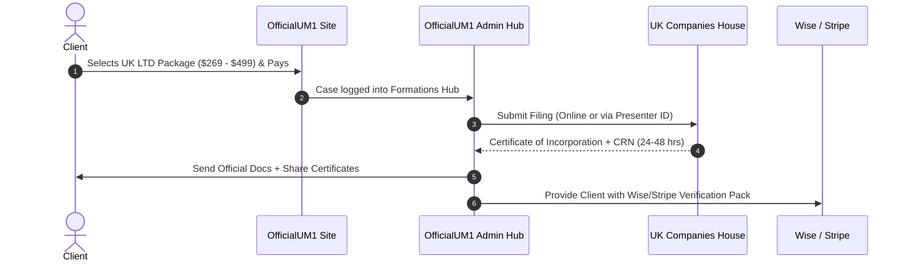

# OfficialUM1 — UK Company Formation & Companies House Playbook

> **Document Type:** Operational & Integration Guide  
> **Target Jurisdiction:** United Kingdom (Companies House & HMRC)  
> **Last Updated:** September 2026  
> **Status:** Active Reference  

---

## 1. Executive Summary & Fee Architecture

Under the **Economic Crime and Corporate Transparency (ECCT) Act**, UK Companies House revised its official statutory fees.

### Official Statutory Cost (Real Wholesale Expense)
| Item | Provider | Statutory / Wholesale Cost |
| :--- | :--- | :--- |
| **Online Company Incorporation** | UK Companies House | **£100** (~$130) |
| **Annual Confirmation Statement (CS01)** | UK Companies House | **£50** (~$65) |
| **London Registered Office Address (1 Year)** | Wholesale Address Provider *(1st Formations / My Company Registration)* | **£15 – £25 / year** (~$20 – $32) |
| **Mail Scanning & Forwarding** | Virtual Address Agent | Included or £10 – £20 |
| **Total Baseline Cost per LTD** | — | **~$150 – $160** |

---

## 2. OfficialUM1 Selling Packages & Profit Margins

| Package | Client Price | Real Cost | Net Profit | Deliverables |
| :--- | :--- | :--- | :--- | :--- |
| **Starter UK LTD** | **$269** | ~$155 | **+$114** | Certificate of Incorporation, Memorandum & Articles, 1-Yr London Address, Government Fee Paid |
| **Stripe & Banking Pro** | **$349** | ~$155 | **+$194** | Starter + Wise/Payoneer Business Account Approval Guide + Stripe UK Setup + HMRC UTR Tracking |
| **E-Commerce & Amazon Elite** | **$499** | ~$165 | **+$334** | Pro + UK VAT Guidance, Amazon UK / Shopify Compliance Pack, Lifetime Officer Records Vault |

---

## 3. Companies House Credit Account (Fee-Bearing Presenter Account)

### What is a Credit Account?
By default, filing each company requires manual debit/credit card payments of £100.  
A **Companies House Credit Account** provides a dedicated **Presenter ID** and **Presenter Authentication Code**, enabling:
1. **Automated & Software-based Filings:** Direct API or batch filing without entering payment details for every client.
2. **Consolidated Monthly Billing:** Companies House sends a monthly invoice for all filings submitted during the billing period.
3. **Agency Status:** Official recognition as a registered corporate presenter.

---

## 4. How to Apply for a Companies House Credit Account

### Step 1: Application Form
- Download the official application form from GOV.UK:  
  [Apply for a Companies House credit account (GOV.UK)](https://www.gov.uk/government/publications/apply-for-a-companies-house-credit-account)

### Step 2: Information Required in Form
1. **Organization Name & Type** (OfficialUM1 / Agency Entity)
2. **Registered Office Address & Contact Person**
3. **Direct Debit / Bank Account Details** (For monthly settlement)
4. **Estimated Monthly Filing Volume**

### Step 3: Submission via Email
- Send completed PDF to the dedicated Companies House finance department:  
  📧 **`chdfinance@companieshouse.gov.uk`**

### Step 4: Turnaround Time & Credentials
- **Processing Time:** Approved on 29 September 2026.
- **Application Status:** **APPROVED** (Companies House Credit Control `chdfinance@companieshouse.gov.uk`).
- **Presenter ID:** `[CONFIDENTIAL - SECURE VAULT]`
- **Authentication Code:** Issued (Pending UK Bacs Direct Debit bank update).

---

## 5. Client Formation Workflow (Step-by-Step)

---

## 6. Authorised Corporate Service Provider (ACSP) Rules (ECCT Act)

Under the updated UK regulations:
- Formation agents performing identity verification on behalf of company directors must register as an **Authorised Corporate Service Provider (ACSP)** and be supervised under UK Anti-Money Laundering (AML) regulations (e.g., HMRC AML supervision).
- For standard agency operations, formations can also be filed directly through authenticated corporate filing software or certified wholesale partner channels.

---

## 7. Direct Debit Mandate & Banking Details (Barclays UK)

For the monthly fee-bearing credit account settlement with Companies House, the following UK Direct Debit profile is configured:

| Field | Configured Value |
| :--- | :--- |
| **Account Holder** | Muhammad Umar Mumtaz / OfficialUM1 LLC |
| **Bank Name** | Barclays Bank PLC |
| **Bank Address** | Level 25, 1 Churchill Place, London E14 5HP |
| **Sort Code** | `23-14-86` |
| **Account Number** | `03905664` |
| **Transfer Type** | UK Faster Payments / Direct Debit |
| **Application Script** | [`scripts/fill_companies_house_form.py`](file:///c:/Users/Abc/Desktop/officialum1/scripts/fill_companies_house_form.py) |
| **Completed PDF** | [`OfficialUM1_Companies_House_Credit_Account_FILLED.pdf`](file:///c:/Users/Abc/Desktop/officialum1/OfficialUM1_Companies_House_Credit_Account_FILLED.pdf) |

---

## 8. Hostinger Agency Partner Integration

OfficialUM1 is registered as a **Hostinger Certified Agency Partner**:
- **Directory Listing:** Receives inbound client leads looking for web design & agency infrastructure.
- **Agency Discounts:** 20% discount on agency hosting & servers.
- **Recurring Revenue:** 20% to 40% recurring commission on client renewals.
- **Wholesale Domains:** Wholesale .com domains ($4.99 - $9.99) bundled into formation & web development packages.
- **Codebase MCP:** Integrated via `hostinger-agency-hosting` & `hostinger-domains` tools.

---

## 9. Live Operations & Presenter ID Fulfillment Workflow

When a client places an order on `/services/uk-company-formation`:

### Step 1: Customer Order Intake
- Customer chooses package ($269 Starter / $349 Stripe Pro).
- Customer inputs: Company Name, Director Full Legal Name, DOB, Nationality, and Residential Address.
- System automatically creates record in `leads` table and triggers Telegram + Email alerts (`hello@officialum1.com`).
- Client receives branded HTML order confirmation email with Order ID.

### Step 2: KYC & Compliance Verification
- Collect Director Passport / Smart CNIC (English) + Residential Bank Statement (last 3 months).
- Non-UK residents (Pakistani, GCC, etc.) are 100% legally eligible to be sole director/shareholder.

### Step 3: London Registered Office Address Provision
- **Provider:** Icon Offices (`https://iconoffices.co.uk/virtual-offices.php`)
- **Location:** East Ham, London UK (`Suite / Office XX, High Street North, East Ham, London UK`).
- **Plan:** Bronze Plan (Quarterly £12.87 or Annual Discounted ~£25–£35).
- **Statutory Mail:** Companies House & HMRC official statutory letters scanned and emailed as PDF.
- **Alternative:** Icon Offices All-Inclusive Formation (Option a) at £106.86 (£139 USD) covering address + full company incorporation.

### Step 4: Companies House Presenter Filing
- In Admin Panel > **Settings Tab**:
  - `ch_presenter_id` (Presenter ID)
  - `ch_auth_code` (Presenter Auth Code)
  - `ch_credit_account_no` (Credit Account No)
  - Status Indicator: `🟢 Active Presenter`
- Presenter ID bypasses per-transaction debit/credit card payments on government portal.
- Companies House consolidates filings into monthly invoice statement.
- Company registration certificate (CRN) approved within 24–48 hours.

---

## 10. Financial Margins & 100% Full Upfront Payment Policy

### Website Checkout Model (100% Upfront)
OfficialUM1 operates on a strict **100% Full Upfront Payment** model at online checkout (matching global corporate standards like Stripe Atlas and Firstbase):

| Package | Client Online Checkout Price | Real Fulfillment Cost | Instant Net Agency Profit |
| :--- | :--- | :--- | :--- |
| **Starter UK LTD** | **$269 USD** | ~$139 USD (£106.86) | **+$130 USD (~36,000 PKR)** |
| **Stripe & Banking Pro** | **$349 USD** | ~$139 USD (£106.86) | **+$210 USD (~58,000 PKR)** |
| **E-Commerce Elite** | **$499 USD** | ~$149 USD (£114.00) | **+$350 USD (~97,000 PKR)** |

### Why 100% Full Upfront is Superior:
1. **Zero Cashflow Risk:** Client funds ($269 / $349) arrive in full *before* filing fees or address subscriptions are purchased.
2. **Instant Retained Earnings:** OfficialUM1 pockets +$130 to +$210 pure profit immediately on day one.
3. **No Chasing Invoices:** Prevents clients disappearing or refusing final 50% after government registration is already issued.
4. **Annual Address Renewal (Recurring Income):** Client billed $89/year recurring vs $35 wholesale cost = **+$54/year recurring profit per client**.

---

## 11. Operational Reference Contacts & Links
- **Companies House Credit Control:** `chdfinance@companieshouse.gov.uk` | Phone: `0303 1234 500`
- **Icon Offices Virtual Office Portal:** `https://iconoffices.co.uk/virtual-offices.php`
- **Companies House Public Registry:** `https://find-and-update.company-information.service.gov.uk`
- **Admin Settings Tab:** `components/admin/tabs/SettingsTab.tsx`

